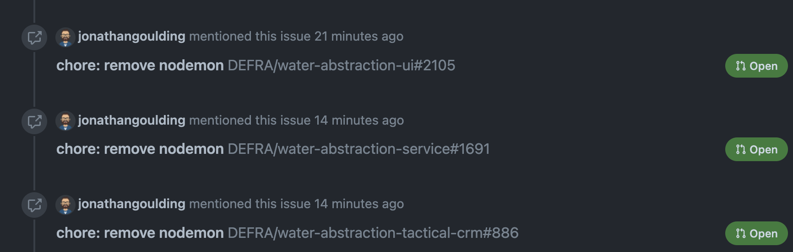

# Contributing

We encourage any in the team (or outside of it!) to contribute to this project and make it better. So, to help we've put together the following guide.

> Don't panic though! If you are still unsure just crack on with your contribution. You can't break anything hear and we'd rather see your idea than miss out because we didn't write this clearly enough.

## Guides and documents

Any suggested change to the project's contents, by which we mean the files and folders, should be done using a PR. Have a read of [ways of working](/ways_of_working.md) first. This is because the format for commits and the way we process PR's here is the same as for any of our code repos.

Assign it a [label](https://docs.github.com/en/issues/using-labels-and-milestones-to-track-work/managing-labels) but again don't panic about correctness. Some suggestions would be

- correcting a typo or incorrect fact? `bug`
- adding a new guide? `enhancement`
- expanding an explanation to make it clearer? `housekeeping`

When ready update the PR state from `draft` to `ready`. Then ping a note in our [Slack channel](https://defra-digital.slack.com/archives/C03EW35SFEY) including a link to the PR. Someone should come take a look!

### Approving the change

This is where the labels come in handy. We don't want to hold up quick changes and corrections. But we also want to allow everyone an opportunity to review and feedback new processes or guides. So, if it's a `bug` or `housekeeping` change as long as one other team member approves it carry on and merge.

If it's something more meaty and worthy of being labelled `enhancement` request a review from each team member and hold off merging until all have approved.

Once approved carry on and hit the `Squash and merge` button. Again, as per our ways of working it'd be great if you could tidy up the commit messages to a single coherent commit.

## Issues

Anyone can add an issue! There are only 3 rules to follow

- check the existing issues in case yours is a duplicate
- check again
- go away, have a goodnights sleep, then check again!

Seriously, issue lists have a habit of getting out of hand especially on a project with as much to fix as **Water Abstractions**. So the list doesn't become unmanageble do please check your not duplicating something, or whether you could instead be adding to an existing one.

Other than that you are good to go. Don't restrict yourself to just problems that need fixing. If there is something new we could be doing, either in code or our processes then feel free to use issues as a way of collecting initial feedback.

### Progressing the issue

Unlike changes via PR there is no formal approval process. But before you immediately dive into, for example, implementing TypeScript, do double-check with your team mates this is something they agree with.

If all good anyone on the tech team is free to get on with an issue. Assign yourself so we know you are dealing with it. If the issue results in changes in other repos link to the issue in the initial commit/PR description. GitHub is clever enough to show them in the issue.

### Providing feedback

The whole team is expected to check-in periodically on the issues and give their feedback. A 👍 is all that is needed to confirm you accept what is being suggested. If you have more add a comment. If you disagree reach out to the contributor, or collar the tech lead to voice your concerns.

### Job done

Again, there is nothing formal to closing an issue. We are relying on folks doing their best for the team.

- If it looks like the idea got no traction add a note and close it
- If it's to 'do a thing' and you've done the thing close it

If you are unsure reach out to the tech lead and they will be happy to advise.
