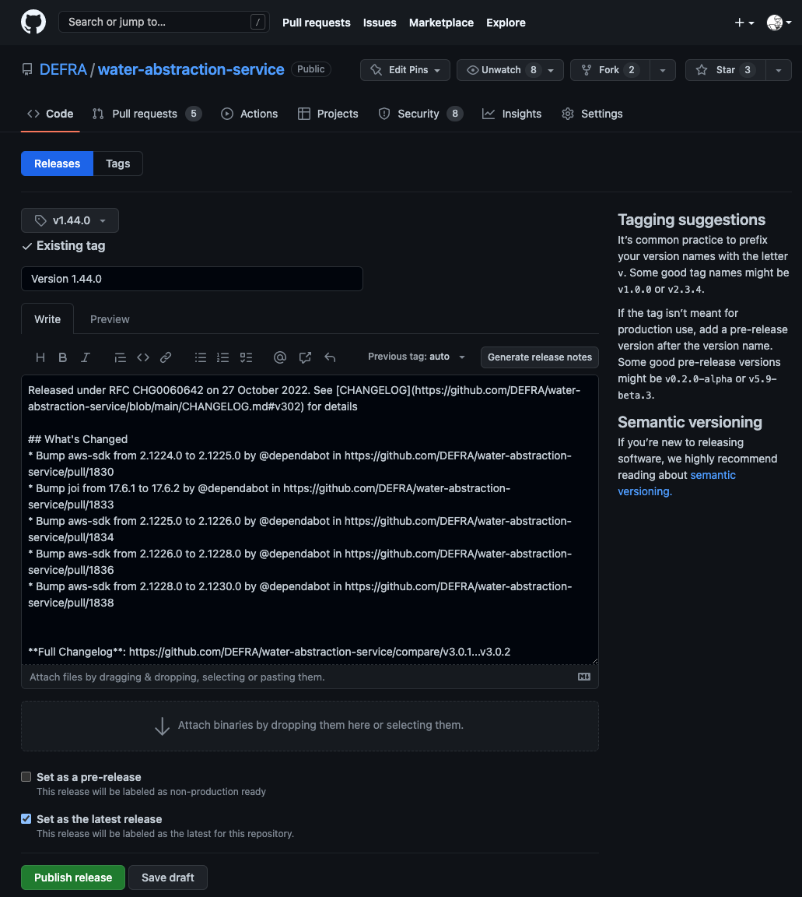

# Release

This covers everything on the day of release and after. All being well and for the majority of releases this should be short and simple.

- [Deploy release](#deploy-release)
- [Smoke test release](#smoke-test-release)
- [Confirm release successful](#confirm-release-successful)
  - [Change management](#change-management)
  - [Regime leads](#regime-leads)
- [Record release in GitHub](#record-release-in-github)
- [In the event of errors](#in-the-event-of-errors)
  - [Deployment fails](#deployment-fails)
  - [Service fails](#service-fails)
  - [Rollback](#rollback)

## Deploy release

We typically have no direct involvement as all changes to production are done by web-ops. At least one person from the development team should be on hand to answer any questions or deal with any issues that arise.

## Smoke test release

Once web-ops confirm the changes have been applied, the test analyst will perform a series of [smoke tests](https://en.wikipedia.org/wiki/Smoke_testing_(software)) to confirm the service is still up and running.

## Confirm release successful

We need send an email to change management and web-ops to confirm the RfC was successful. We let the rest of the delivery team know by putting a post in the team's [Teams channel (MSFT-Defra )](https://teams.microsoft.com/l/team/19%3acSnPCAkeDlujg1vdWAzicBz8xLDXSZgD3hhTSK7QFr81%40thread.tacv2/conversations?groupId=051160dd-3d14-4f28-8354-725992c0cf4c&tenantId=770a2450-0227-4c62-90c7-4e38537f1102)

### Email

Create an email with approximately the following format and send to **SM-Defra-Change Adminstration**. In `CC` add web-ops shared email (**SM-Defra-ddts-aws-webops**).

```text
Subject: [RfC reference] completed successfully

Hello

This is to let you know [RfC reference] for the Water Resource Licencing service (WRLS) was completed successfully.

[Sign off]
```

### Teams

Create a post with approximately the following format and send to the team's [Teams channel (MSFT-Defra )](https://teams.microsoft.com/l/team/19%3acSnPCAkeDlujg1vdWAzicBz8xLDXSZgD3hhTSK7QFr81%40thread.tacv2/conversations?groupId=051160dd-3d14-4f28-8354-725992c0cf4c&tenantId=770a2450-0227-4c62-90c7-4e38537f1102)

```markdown
@General Happy to confirm that the release **CHG0059773** was completed successfully.
```

## Record release in GitHub

We use [GitHub's release](https://docs.github.com/en/github/administering-a-repository/about-releases) functionality to track our releases to production. They form a quick and handy reference as to what versions of the code got released to production and when.

Go to the relevant GitHib project and select the 'Releases' tab then click the _Draft a new release_ button. Select the tag for that repo's version in the 'release'. For the title just use the version, for example, `Version 1.44.0`. In the description add the following.

```text
Released under RFC [reference] on [Date - DD MMMM YYYY]. See [Link to CHANGELOG.MD] for details
```

The link for the changelog can be found in `CHANGELOG.md`. Look for the heading which matches the version just released.

After you've added this text click the _Generate release notes_ button. GitHub will automatically add a detailed **What's Changed** section to the release. This screenshot is an example of a completed GitHub release



## In the event of errors

If any errors occur the next steps will depend on where and when they happen, and their severity. In principle we aim for a 'fix-forward' approach; stick with the release but aim to roll out another expedited/emergency release as soon as possible.

### Deployment fails

Our deployment creates a timestamped release folder for each repo being deployed in a 'release'. Each also has a [`current` symlink](https://www.freecodecamp.org/news/symlink-tutorial-in-linux-how-to-create-and-remove-a-symbolic-link/) which is updated to point to the new release folder. Updating the symlink is the very last step in a deployment. So, if something fails during deployment, you can be confident no changes have been made and the running version is left untouched.

If deployment has failed, first confirm the currently running version of the app has not changed. Then investigate the issue with deployment and determine the fault. If it can be fixed quickly without changes to the app code and web-ops are happy, try the deployment again.

Else report back to **SM-Defra-Change Administration** the RfC was unsuccessful. Log the issue in the backlog and prioritise and implement as normal.

### Service fails

If the deployment was successful but smoke testing raises an issue with the service, convene an urgent team call.

The issue and its impact to users needs to be discussed; are there workarounds, how many users affected, how often will the issue occur etc?

Accepting you're in the middle of the crisis, the team should use its best judgement whether to prioritise an urgent fix or roll-back to a previous version.

If [rolling back](#rollback) see the section below.

If _fixing-forward_ on a new RfC confirm the release as completed to **SM-Defra-Change Administration** but alter the email to let them know an issue was found and another RfC will need to be raised to deal with it.

> Note; if the fix can be released under a **Standard Change** ([see Schedule](/releasing/schedule.md)) we can get it out just as soon as web-ops are willing. Else the quickest you can get a fix in place under an emergency RfC is 3 days. You will also be _strongly_ challenged on the severity of the issue and its impact on the agency and its reputation.

### Rollback

Only use rollback if the only option to return an app to stable operation is to return to the previous deployed version.

The rollback process is

- web-ops update the `current` symlink of the affected app on each backend instance (see [Example symlink update](#example-symlink-update))
- test engineer carries out smoke testing to confirm return of service
- send email to **SM-Defra-Change Administration** reporting the RfC as unsuccessful
- log the issue in the backlog and prioritise and implement as normal

#### Example symlink update

> We intend to automate this in the future

In this example, the [water-abstraction-service](https://github.com/DEFRA/water-abstraction-service) needs to be rolled back.

```bash
cd /srv/app/node/water-abstraction-service

# Identify which folder `current` is pointing to
readlink current # /srv/app/node/water-abstraction-service/releases/20221020_135330

# List release folders in descending order to identify which to rollback to
ls -r releases/ # 20221020_135330  20221018_143647  20221003_103756  20220928_110051  20220928_084923

# Update the symlink
ln -s -f -n /srv/app/node/water-abstraction-service/releases/20221018_143647 /srv/app/node/water-abstraction-service/current

# Reload the apps
pm2 reload water-api --update-env
pm2 reload service-background --update-env
```
