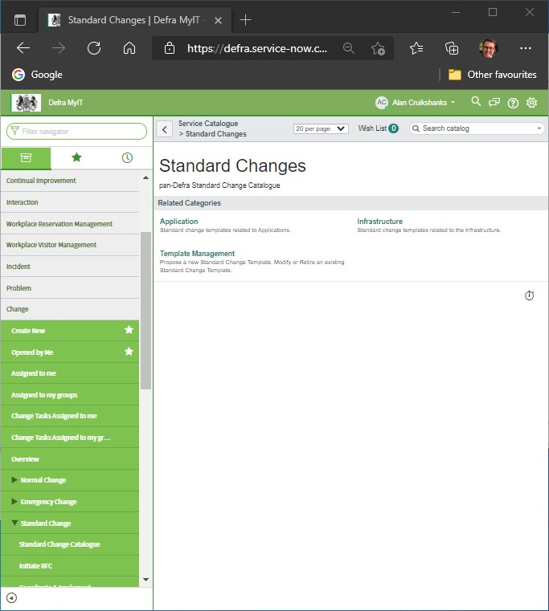
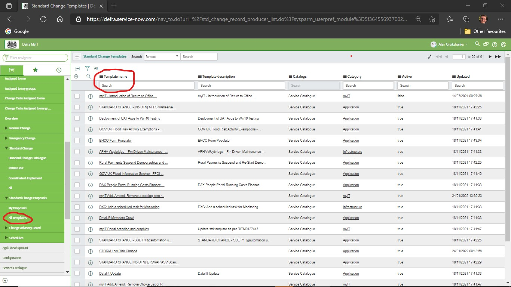
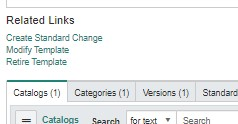

# Standard RfC example

The following is an example of a completed myIT **standard** RfC. This is based on **Standard Change STDCHG0001211 - Water Resources Licencing Service Release**.

You should be able to use it as the basis for new ones. Most fields will be completed for you because they come from the `STDCHG0001211` template. This covers any additional fields you'll need to update that the template does not cover.

## Creating the RfC

We have found different members of the team see different menu options in myIT. [Option 1](#option-1) is the easiest but if you don't see `Standard Change Catalogue` [Option 2](#option-2) should work for you. In both cases once you have found the `Water Resources Licencing Service Release` template a new RfC will appear pre-populated based on it. The rest of the guide covers the fields that still need completing.

### Option 1

In the myIT menu go to `Change -> Standard Change -> Standard Change Catalogue`. Select `Application` from the options presented. `Water Resources Licencing Service Release` is normally last in the list on the last page. But use the search if you are having trouble finding it. Select it when you have.

### Option 2

In the myIT menu go to `Change -> Standard Change Proposals -> All Templates`. In the `Template name` search field enter **Water** then press 'Return/Enter' key.

`Water Resources Licencing Service Release` should be one of the results (most likely the only one). Select it and you will be shown the proposal which was submitted to obtain approval for the standard change. Towards the bottom of the page is the 'Related links' section. Select `Create Standard Change`.

## Top section

Below the sub-headings refer to fields. Quoted content represents an example of what to enter.

### Department

> Defra

### Sponsor

> Andy Turner

### BAU or project

> BAU

## Schedule

The form will set the planned start date to `undefined`. For standard changes we would still need to liase with web-ops to pick a suitable time..

### Planned start date

Select a date and time as agreed by the team, for example, `21/11/2022 09:00:00`

### Planned end date

Allow enough time to complete the change with some allowance for any possible issues, for example `21/11/2022 10:00:00`
